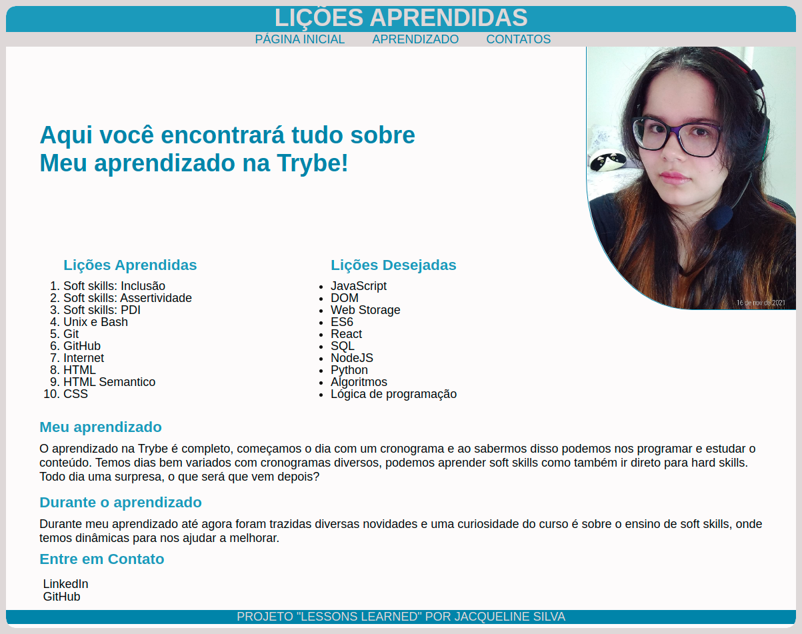

# Projeto Lessons Learned

Projeto realizado com o fim de testar nossos conhecimentos referente ao bloco 03 do módulo de Fundamentos da Trybe, onde aprendemos sobre HTML e CSS

## Proposta

Desenvolver um site que contenha todos os aprendizados adquiridos no curso até o momento

## Habilidades desenvolvidas

- HTML para construir páginas Web
- HTML semântico para tornar a página mais acessível
- CSS para estilização

## Stack utilizada

- HTML
- CSS

## 🔗 Contato

